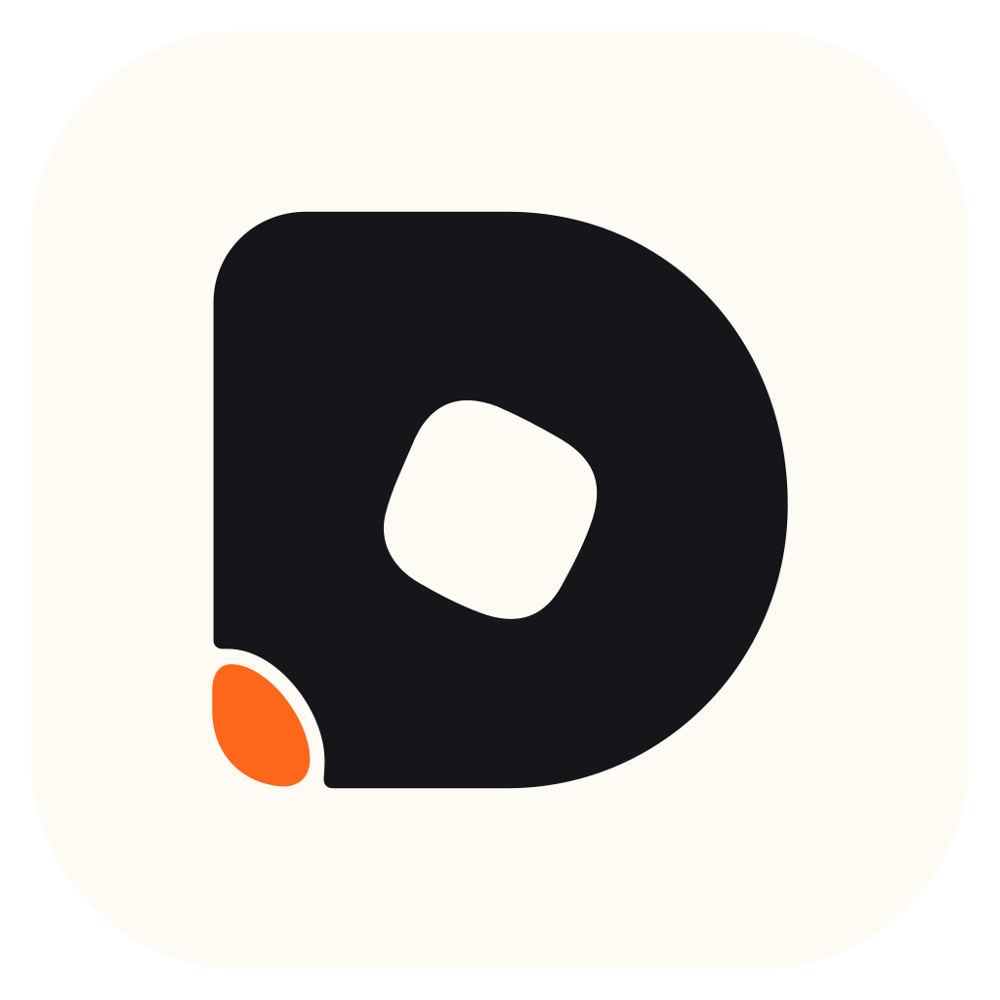

<div align="center">
  

  <h1>Dispatch</h1>

  <p><strong>Run coding agents where your code lives. Control them from anywhere.</strong></p>

  <p>
    A local-first workspace for agent threads, terminals, projects, remote environments,
    model providers, and agent teams — across desktop, web, and mobile.
  </p>

  <p>
    <a href="https://github.com/eminuckan/dispatch/actions/workflows/ci.yml">
      
    </a>
    <a href="https://github.com/eminuckan/dispatch/releases">
      
    </a>
    <a href="./LICENSE">
      
    </a>
  </p>

  <p>
    <a href="https://github.com/eminuckan/dispatch/releases"><strong>Releases</strong></a>
    ·
    <a href="./docs/README.md"><strong>Documentation</strong></a>
    ·
    <a href="./docs/user/remote-access.md"><strong>Remote access</strong></a>
    ·
    <a href="./CONTRIBUTING.md"><strong>Contributing</strong></a>
  </p>
</div>

---

## What is Dispatch?

Dispatch is an independent open-source control surface for coding agents. The environment that owns your
code also owns the work: projects, threads, terminals, provider credentials, and execution stay on that
machine by default, while Dispatch clients give you a consistent way to operate it locally or remotely.

Use the provider tooling you already trust, keep multiple projects and worktrees moving in parallel, hand
work to agent teams, review source-control changes, and reconnect from another computer or phone without
turning your development machine into a thin client for someone else's runtime.

### Highlights

|                           |                                                                                                               |
| ------------------------- | ------------------------------------------------------------------------------------------------------------- |
| **Local-first execution** | Agents run in the environment that owns the project and its credentials.                                      |
| **Bring your providers**  | Codex, Claude, Cursor, Grok, OpenCode, and Antigravity can coexist in one workspace.                          |
| **Desktop, web, mobile**  | Electron desktop, environment-served web, and iOS/Android clients share the same environment model.           |
| **Remote environments**   | Pair directly over LAN/private networks, use Tailscale HTTPS, connect over SSH, or opt into Dispatch Connect. |
| **Parallel work**         | Threads, worktrees, terminals, model routing, and managed agent teams are built around concurrent work.       |
| **Source-control aware**  | GitHub, GitLab, Forgejo/Gitea, Bitbucket, and Azure DevOps integrations live alongside the agent workflow.    |
| **Explicit permissions**  | Choose how much autonomy an agent gets instead of treating every tool call as equally trusted.                |

## Clients & platforms

Dispatch is one system with multiple control surfaces:

| Client      | Platforms             | Current distribution                                                                                                   |
| ----------- | --------------------- | ---------------------------------------------------------------------------------------------------------------------- |
| **Desktop** | macOS, Linux, Windows | Release pipeline supports desktop packaging; the currently published Dispatch preview is macOS Apple Silicon.          |
| **Web**     | Modern browsers       | Served by a Dispatch environment. There is no public hosted Dispatch web app advertised today.                         |
| **Mobile**  | iOS, Android          | Mobile client and EAS pipelines live in this repository; no public App Store or Google Play release is advertised yet. |

The release page is the source of truth for downloadable artifacts. A platform being supported by the
build/release pipeline does not mean a public artifact has already been published for it.

## Remote access

You do not need Dispatch Connect to use Dispatch remotely.

| Path                    | Account required? | What it is for                                                                                                      |
| ----------------------- | ----------------- | ------------------------------------------------------------------------------------------------------------------- |
| **Direct pairing**      | No                | Pair a browser, phone, or desktop client over a reachable LAN or private-network address.                           |
| **Tailscale HTTPS**     | No                | Put the host and client on the same tailnet and expose the Dispatch environment over HTTPS.                         |
| **Desktop-managed SSH** | No                | Let the desktop app start/reuse Dispatch on another Linux or Apple Silicon Mac and forward the connection.          |
| **Dispatch Connect**    | Optional          | Hosted or self-hosted discovery and managed reachability while explicit environment authorization remains in force. |

Dispatch Connect is a control plane, not the authority for your project data. It can help clients discover
environments, rendezvous for pairing, and find a usable reachability path; the environment still owns its
threads, projects, provider credentials, and scoped client sessions.

Read the full [remote-access guide](./docs/user/remote-access.md) or the
[Dispatch Connect architecture notes](./docs/internals/dispatch-connect.md).

## Releases

Dispatch is **pre-stable**. There is no stable/latest Dispatch release yet.

The first Dispatch-owned public preview is
[`v0.0.43-preview.20260921.4`](https://github.com/eminuckan/dispatch/releases/tag/v0.0.43-preview.20260921.4),
with a Developer ID-signed and Apple-notarized **macOS Apple Silicon** DMG/ZIP plus checksums.

For newer previews and future platform artifacts, always use
[GitHub Releases](https://github.com/eminuckan/dispatch/releases). Do not use upstream T3 Code installers
or package-manager entries as substitutes for a Dispatch build.

## Quick start from source

### Requirements

- Git
- Node.js `^24.13.1`
- [Vite+](https://vite.plus) and its `vp` command
- At least one coding-agent provider installed and authenticated on the environment that will run it

Install Vite+:

```bash
# macOS / Linux
curl -fsSL https://vite.plus | bash
```

```powershell
# Windows PowerShell
irm https://vite.plus/ps1 | iex
```

Clone Dispatch and install the workspace:

```bash
git clone https://github.com/eminuckan/dispatch.git
cd dispatch
vp i
```

Run the local server and web client:

```bash
vp run dev
```

Or launch the Electron desktop client:

```bash
vp run dev:desktop
```

For local packaging, mobile development, and platform-specific workflows, start with the
[development runbook](./docs/operations/development.md) and
[mobile development notes](./docs/internals/mobile-development.md).

## Providers

Provider authentication belongs to the environment where the provider runs. Dispatch does not replace
the provider's own account, CLI, or credential flow.

| Provider        | Runtime / sign-in                                                                                          |
| --------------- | ---------------------------------------------------------------------------------------------------------- |
| **Codex**       | Install [Codex CLI](https://developers.openai.com/codex/cli), then run `codex login`.                      |
| **Claude**      | Install [Claude Code](https://claude.com/product/claude-code), then run `claude auth login`.               |
| **Cursor**      | Install [Cursor CLI](https://cursor.com/cli); the executable is `cursor-agent` and login is `agent login`. |
| **Grok**        | Install [Grok Build CLI](https://x.ai/cli), then run `grok login`.                                         |
| **OpenCode**    | Install [OpenCode](https://opencode.ai), then run `opencode auth login`.                                   |
| **Antigravity** | Enable it in Dispatch provider settings and use the managed Google sign-in flow.                           |

Dispatch also supports multiple configured instances of a provider when you need separate accounts,
environment variables, API endpoints, or credentials.

## Documentation

Start with the [documentation index](./docs/README.md).

- [Install and first run](./docs/user/install.md)
- [Working with threads](./docs/user/thread-sidebar.md)
- [Messages and context](./docs/user/composer.md)
- [Permission modes](./docs/user/permission-modes.md)
- [Project settings](./docs/user/project-settings.md)
- [Source-control integrations](./docs/user/source-control.md)
- [Remote access](./docs/user/remote-access.md)
- [Running in the background](./docs/user/background-service.md)
- [Updating Dispatch](./docs/user/updating.md)

For contributors and operators:

- [Development runbook](./docs/operations/development.md)
- [Release runbook](./docs/operations/release.md)
- [Dispatch Connect deployment](./docs/operations/dispatch-connect.md)
- [Contributing](./CONTRIBUTING.md)
- [Security policy](./.github/SECURITY.md)

## Origin & thanks

Dispatch began from the open-source [T3 Code](https://github.com/pingdotgg/t3code) codebase created by
T3 Tools. Dispatch now evolves as an **independent open-source project**, with its own product direction,
branding, infrastructure, and release path.

Thank you to the T3 Code maintainers and contributors for the foundation Dispatch was able to build on.
The upstream MIT copyright and license notice are retained.

### Compatibility note

Some compatibility identifiers intentionally keep their upstream spelling, including the `t3` CLI alias,
legacy `.t3` state adoption, selected `T3CODE_*` environment fallbacks, and native/runtime ABI names.
Those names exist to keep upgrades and upstream-compatible
workflows functioning; they are not current Dispatch branding.

## License

Dispatch is available under the [MIT License](./LICENSE) and retains the upstream copyright notice.
